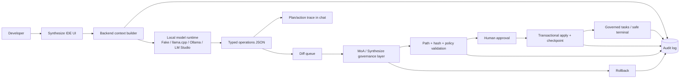

# Submission architecture

## Trust boundary

The local model is outside the trusted action boundary. It can only emit typed operations. Synthesize/MoA owns validation, user approval, transactional apply, command policy, rollback, and audit persistence.

## Contest message

Synthesize IDE demonstrates how local/open agent tooling can make AI coding transparent and governable without requiring paid model services. Paid providers can be added as optional runtimes, but the safety architecture does not depend on them.
